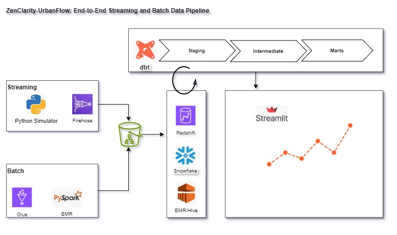
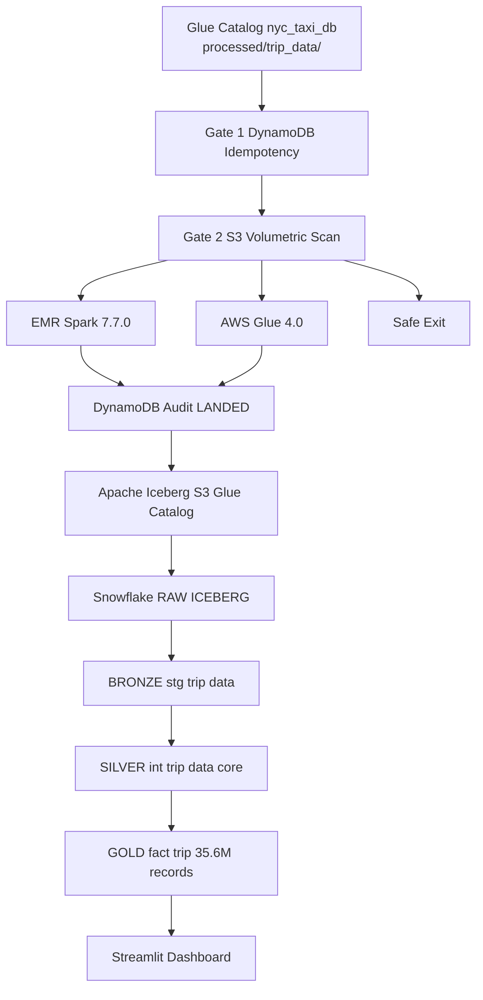
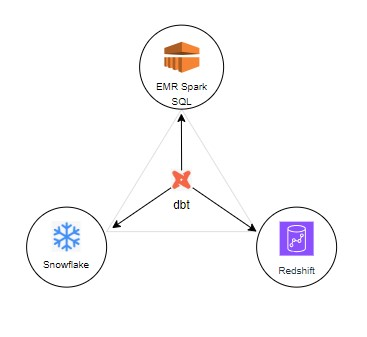

# 🌆 ZenClarity-UrbanFlow — NYC Taxi Data Engineering Platform
> **A modern data engineering platform** combining streaming + batch pipelines, dbt-powered transformations,
> and multi-engine analytics across **Redshift Serverless**, **Snowflake**, and **EMR Spark.**
> Designed for **portability**, **scalability**, **cost-performance benchmarking**, and **real-time insights** delivered via Streamlit.

---

## 🚀 V2 — Production Delivery Status

| Component | Status | Notes |
|---|---|---|
| Iceberg staging table — `trip_data_v2_stage` | ✅ Confirmed | Partitioned on `day(pickup_datetime)` |
| Glue backfill job | ✅ Confirmed | Serverless · schema-aligned · audit-free |
| EMR Spark backfill job | ✅ Confirmed | 4× faster than Glue at scale |
| Glue vs EMR benchmark | ✅ Confirmed | 42M records · 6 min vs 1.5 min · threshold configurable |
| Airflow DAG — volumetric router | ✅ Confirmed | Cost-aware engine selection · both engines live |
| DynamoDB idempotency audit | ✅ Confirmed | Day-granularity · permanent records · batch reads |
| dbt staging layer | ✅ Confirmed | `stg_trip_data` · 8 tests passing · Snowflake live |
| dbt intermediate layer | ✅ Confirmed | `int_trip_data_core` · incremental · dedup · DQ models · 10 tests passing |
| dbt mart layer | ✅ Confirmed | `fact_trip` · 35.6M records · tip_pct · time_of_day · airport flag |
| Monthly delta ingestion → Iceberg | 🔧 In Progress | V1 Glue job still active on `/processed/` · re-point underway |
| Airflow DAG — full pipeline cutover | 🔧 In Progress | Replaces Step Functions · adds dbt downstream |
| Snowflake Iceberg integration | ⬡ Next | External volume + storage integration |
| CI/CD — GitHub Actions | ○ Planned | dbt test on PR · deploy on merge |

---

## 🏗️ V2 Core Design — Iceberg Backfill & Migration Framework

### What Was Built
A production-grade, cost-aware backfill framework migrating **42M+ NYC Taxi records** into **Apache Iceberg**
with full idempotency, multi-engine routing, and audit traceability.

### How It Works

```
Airflow DAG — engine_volumetric_router
       │
       ├─ Gate 1: DynamoDB idempotency check
       │          → expand any slice (year/month/day) to day-level keys
       │          → batch read 100 keys/call — skip all LANDED slices
       │
       ├─ Gate 2: S3 volumetric scan
       │          → size > 0.05 GB  →  EMR Heavy Serve
       │          → size ≤ 0.05 GB  →  Glue Net Play
       │          → empty slice     →  safe exit
       │
       ├─ Engine fires → reads S3 parquet → aligns schema → writes Iceberg
       │
       └─ write_audit_landed → batch writes LANDED records to DynamoDB
                               retries=3 · retry_delay=30s
```

### Key Design Decisions
- **DAG owns all audit writes** — Glue and EMR scripts are audit-free, single-responsibility
- **Day-granularity idempotency** — month/year slices expand to day keys, preventing overlap double-writes
- **Permanent audit records** — TTL removed, full lineage preserved
- **batch_id format:** `engine#cab_type#yyyy_mm_ref#uuid8` — engine + slice traceable in every record

### Benchmark Results

Benchmark run on full 2024 NYC Taxi dataset — **42M records** across all cab types.

| Engine | Version | Runtime | vs Glue Baseline |
|---|---|---|---|
| AWS Glue | Baseline | ~6 min | — |
| EMR Spark | Baseline | ~3m 16s | −46% |
| EMR Spark | Optimized (Lean) | ~1m 34s | −74% · **4× faster** |

#### Optimization Story

The benchmark wasn't just a swap from Glue to EMR — it was a three-stage performance investigation
targeting I/O, shuffle, parallelism, and engine overhead.

**Stage 1 — Engine swap (Glue → EMR baseline)**
Running the same job on EMR eliminated Glue's serverless overhead and reduced runtime by ~50%
(6 min → 3m 16s). The remaining gap suggested the workload shape — the DAG itself — was the real bottleneck.

**Stage 2 — Spark UI profiling (3 runs)**
Collected metrics across baseline EMR, executor tuning, and a code-level "Lean" version.
Executor tuning alone produced no meaningful change. Code-level optimization cut runtime to ~1m 34s.

**Stage 3 — DAG optimization (Lean version)**
- Eliminated redundant `unionByName` across cab types — replaced with a single filtered scan
- Combined cab type filtering into one pass — reduced shuffle and stage count
- Added `repartition(60)` before Iceberg write — eliminated small file problem
- Simplified schema alignment logic — reduced DAG complexity without changing output

> The result: **4× improvement** over Glue baseline and **2× improvement** over EMR baseline —
> achieved through DAG simplification alone, with no cluster resize and no compromise
> to schema alignment or partition overwrite correctness.

### Volumetric Routing Threshold

The DAG uses a configurable S3 size scan to select the engine at runtime.
The current demo threshold is set at **0.05 GB** — intentionally conservative
to showcase the routing logic across all slice granularities (day / month / year).

> ⚠️ **Note:** In production, this threshold should be calibrated against
> actual EMR cluster cost vs Glue DPU pricing at target data volumes.
> Spark's cluster spin-up overhead means the true cost crossover point
> occurs at significantly higher volume than 0.05 GB.
> This framework demonstrates the **routing pattern and scalability** —
> the threshold is a tunable parameter, not a fixed boundary.

---

## 🗺️ Architecture
### V2 — Lakehouse Architecture
> 📐 Full V2 Lakehouse Architecture diagram in progress —
> will be updated soon with Airflow orchestration,
> streaming ingestion, Iceberg layer, dbt medallion stack,
> and observability layer end to end.



**V2 Architecture — Iceberg Migration Framework**



> ⚠️ **Engine Routing Threshold Note:**
> The volumetric threshold shown above is **configurable and environment-specific** —
> not a fixed boundary. AWS Glue 4.0 is a capable, production-grade engine
> suitable for large workloads. The routing decision accounts for:
> - EMR cluster spin-up overhead vs Glue's serverless startup
> - DPU pricing vs EMR instance cost at target data volumes
> - Workload shape — shuffle-heavy jobs favor EMR; simple scans favor Glue
>
> In this benchmark, the crossover was observed at ~0.05 GB for our specific
> cluster configuration and workload. **Production thresholds must be calibrated
> against your own cost model and data volumes.**

---

## 🌐 Portability — One dbt Codebase → Three Engines
> One dbt codebase runs on **Snowflake**, **Redshift**, and **EMR Spark** —
> true engine flexibility with no rewrites.


(docs/arch_diagrams/ZenClarity-UrbanFlow_architecture.jpg)

**Why it matters**
- Avoids vendor lock-in and simplifies migrations
- Enables apples-to-apples benchmarking across engines
- Keeps analytics consistent and DRY with shared models and macros

---

## 📊 Project Highlights

### Data Ingestion
- **Streaming:** Python simulator + Kinesis Firehose for near real-time ingestion
- **Batch:**
  - AWS Glue — serverless ETL for small-to-medium payloads
  - EMR Spark — distributed batch processing for large-scale backfill

### Data Lake & Storage
- Central **Amazon S3** data lake with **Apache Iceberg** table format (V2)
- **DynamoDB** — idempotency audit table (`UrbanFlow_Migration_Audit`)
  - Day-granularity slice tracking · permanent records · batch read pattern

### Data Transformation
- ETL: AWS Glue + EMR Spark
- ELT: dbt multi-layer (staging → intermediate → marts)
- V2: Full medallion stack confirmed on Snowflake + Iceberg ✅

### Data Warehousing
- **Redshift Serverless** — streaming and batch analytics
- **Snowflake** — bulk loading, benchmarking, Iceberg external tables
- **EMR Spark SQL** — distributed queries and performance testing

---

## ⚙️ Orchestration

### V2 — Airflow Volumetric Router (Current)
**DAG:** `engine_volumetric_router`
- Cost-aware engine selection at runtime based on S3 slice size
- DynamoDB idempotency gate — prevents duplicate processing
- Partial slice support — pending keys passed via XCom
- Both engines confirmed working in production

### V1 — Step Functions + Airflow (Baseline)
- **AWS Step Functions** — production Glue-based pipeline to Redshift
- **Apache Airflow (Docker)** — EMR Spark batch runs for custom workloads

---

## 📂 Repo Structure

```text
ZenClarity-UrbanFlow-V2/
├─ iceberg_backfill_migration_framework/   ← V2 NEW
│  ├─ scripts/
│  │  ├─ engine_volumetric_router.py       ← Airflow DAG
│  │  ├─ glue_iceberg_backfill_migration.py
│  │  ├─ emr_iceberg_backfill_migration.py
│  │  └─ iceberg_migration_utils.py
│  └─ README.md                            ← Framework deep-dive
├─ dbt/
│  ├─ models/
│  │  ├─ staging/                          ← Bronze layer
│  │  │  ├─ stg_trip_data.sql
│  │  │  └─ stg_taxi_zone_lookup.sql
│  │  │  └─ sources.yml  
│  │  ├─ intermediate/                     ← Silver layer
│  │  │  ├─ int_taxi_zone_lookup.sql
│  │  │  ├─ int_trip_data_core.sql
│  │  │  ├─ int_trip_data_quarantine.sql
│  │  │  └─ int_trip_data_dq_duplicates.sql
│  │  └─ marts/                            ← Gold layer
│  │     ├─ fact_trip.sql
│  │     ├─ dim_date.sql
│  │     ├─ dim_taxi_zone.sql
│  │     └─ dq_trip_issue_summary.sql
│  └─ packages.yml
├─ analytics/
├─ config/
├─ docs/
│  ├─ arch_diagrams/
│  ├─ benchmarks/
│  ├─ metrics/
│  └─ runbooks/
├─ infrastructure/
│  ├─ emr/
│  ├─ glue/
│  ├─ redshift/
│  └─ snowflake/
├─ scripts/
│  ├─ airflow/
│  ├─ batch/
│  ├─ emr_jobs/
│  ├─ streaming/
│  └─ helpers/
├─ tools/
│  └─ airflow-docker/
└─ README.md
```

---

## 📈 dbt Modeling

> Full medallion stack — staging → intermediate → marts — confirmed working on Snowflake + Iceberg ✅

**Bronze — Staging (`STG_NYC_TAXI`)**
- `stg_trip_data` — view · 1:1 with Iceberg source · cast + rename only · 8 tests passing
- `stg_taxi_zone_lookup` — view · 1:1 with Iceberg source · cast + rename only · 


**Silver — Intermediate (`INT_NYC_TAXI`)**
- `int_trip_data_core` — incremental table · quality filtered · deduped on `dropoff_datetime` · zone enriched · surrogate keyed · 10 tests passing
- `int_trip_data_quarantine` — live DQ view · self-healing · bad quality trips flagged with reason array
- `int_trip_data_dq_duplicates` — live DQ view · duplicate submission detection · fare/distance/dropoff variance signals for upstream investigation

**Gold — Marts (`MART_NYC_TAXI`)**
- `fact_trip` — incremental table · 35.6M records · pre-computed metrics: `tip_pct` · `time_of_day` · `is_airport_trip`
- `dim_taxi_zone` — table · 265 taxi zones with borough + service zone
- `dim_date` — table · 2020–2030 calendar dimension
- `dq_trip_issue_summary` — view · aggregated DQ signals by load date + failure reason

📑 [View dbt Project Documentation (S3 Hosted)](http://nle-dbt-docs.s3-website-us-east-1.amazonaws.com/#!/overview)

---

## 📊 Dashboard KPIs (Streamlit)
- Trips count · Total fare revenue · Average trip delay
- Passengers carried · Trips per minute
- Real-time vs baseline comparison · Cumulative trip chart


---

## 🌐 Technologies Used

**AWS:** S3 · Kinesis Firehose · Glue · Lambda · Step Functions · EventBridge
· DynamoDB · Athena · Redshift Serverless · EMR (Spark, Hive) · Apache Iceberg

**Other:** dbt Core 1.11 · Snowflake · Airflow · Python · PySpark · Streamlit

---

## 📚 Roadmap

**V2 Phase 1 — Confirmed ✅**
- Iceberg staging table + backfill framework (Glue + EMR)
- Cost-aware Airflow DAG with DynamoDB idempotency audit
- Both engines benchmarked and confirmed working
- Full dbt medallion stack — staging + intermediate + marts on Snowflake + Iceberg

**V2 Phase 2 — In Progress 🔧**
- Monthly delta ingestion Glue job re-pointed to Iceberg (replaces V1 `/processed/` path)
- Airflow DAG replacing Step Functions — adds dbt downstream of engine success
- Dashboard update — Streamlit + QuickSight on V2 mart layer

**V2 Phase 3 — Next ⬡**
- Snowflake Iceberg external tables + storage integration
- Benchmark: Snowflake Iceberg vs original external table
- Benchmark: Redshift Spectrum vs Snowflake external table
- CI/CD — GitHub Actions (dbt test on PR · deploy on merge)

**V3 — Planned ○**
- Reconciliation DAG — DynamoDB LANDED vs Iceberg partition drift detection
- Data quality layer — dbt-expectations + referential integrity tests
- Predictive analytics — surge demand zones

---

## 💡 Inspiration
> *"ZenClarity-UrbanFlow embodies the idea that modern data engineering should empower everyone — from data producers to data consumers; 
> from data engineers to BI analysts — with scalable pipelines, portable models, and AI-driven access
> to insights with ZenClarity."*

---

## 🔗 Connect
- LinkedIn: [le-nguyen-v](https://www.linkedin.com/in/le-nguyen-v/)
- GitHub: [tropily](https://github.com/tropily/ZenClarity-UrbanFlow-V2)
