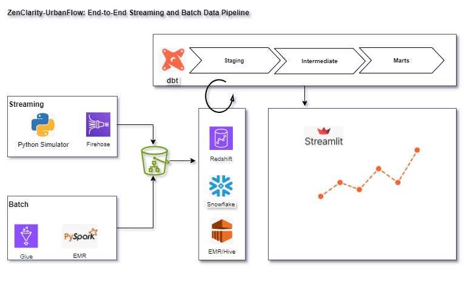
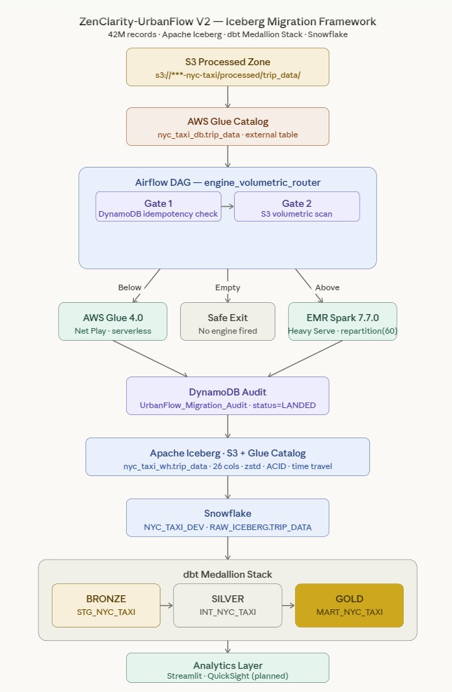
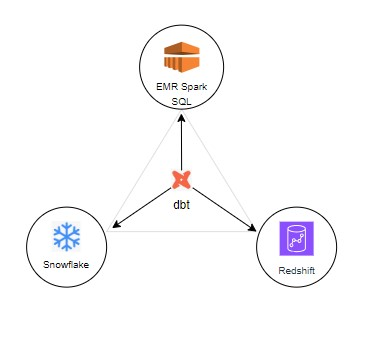
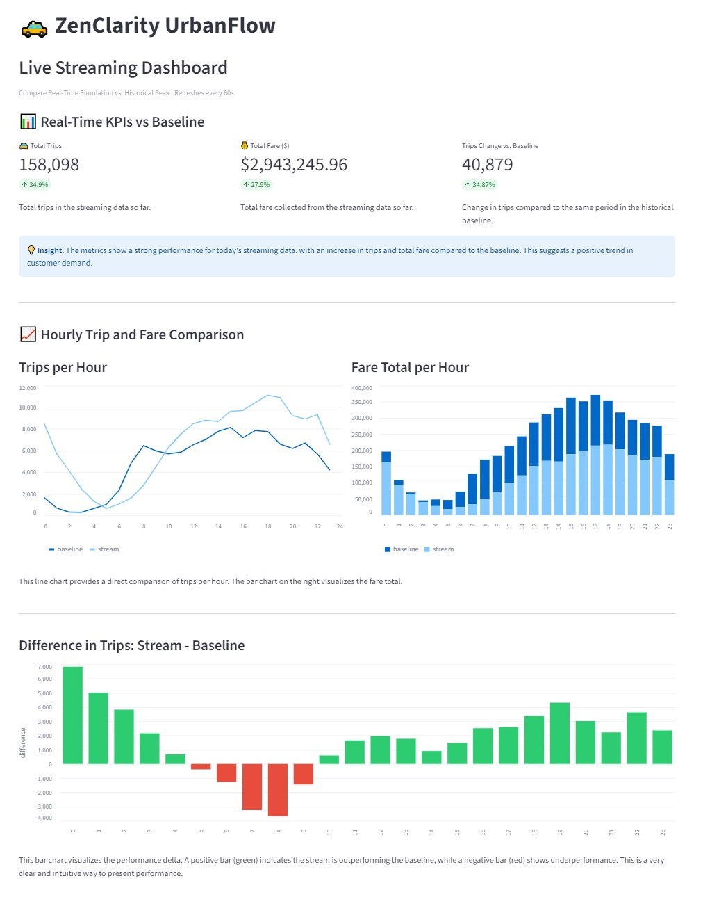

# 🌆 ZenClarity-UrbanFlow - NYC Taxi Data Engineering Platform
> **A modern data engineering platform** combining streaming + batch pipelines, dbt-powered transformations,
> and multi-engine analytics across **Redshift Serverless**, **Snowflake**, and **EMR Spark.**
> Built around a production-grade **Iceberg migration framework** processing 42M+ records with cost-aware
> engine routing - designed for **portability**, **scalability**, **cost-performance benchmarking**,
> and **real-time insights** delivered via Streamlit.

> 📌 **Evolved from V1:** [ZenClarity-UrbanFlow V1](https://github.com/tropily/ZenClarity-UrbanFlow) -
> the original Step Functions · Glue · Redshift pipeline that V2 was built to replace.

---

## 🚀 V2 - Production Delivery Status

| Component | Status | Notes |
|---|---|---|
| Iceberg staging table - `trip_data_v2_stage` | ✅ Confirmed | Partitioned on `day(pickup_datetime)` |
| Glue backfill job | ✅ Confirmed | Serverless · schema-aligned · audit-free |
| EMR Spark backfill job | ✅ Confirmed | 4× faster than Glue at scale |
| Glue vs EMR benchmark | ✅ Confirmed | 42M records · 6 min vs 1.5 min · threshold configurable |
| Airflow DAG - volumetric router | ✅ Confirmed | Cost-aware engine selection · both engines live |
| DynamoDB idempotency audit | ✅ Confirmed | Day-granularity · permanent records · batch reads | 
| Snowflake Iceberg integration |  ✅ Confirmed | External volume + storage integration |
| dbt staging layer | ✅ Confirmed | `stg_trip_data` · 8 tests passing · Snowflake live |
| dbt intermediate layer | ✅ Confirmed | `int_trip_data_core` · incremental · dedup · DQ models · 17/17 tests passing |
| dbt mart layer | ✅ Confirmed | `fact_trip` · 35.6M records · tip_pct · time_of_day · airport flag |
| dbt SCD Type 2 snapshot | ✅ Confirmed | `snap_vendor` · check strategy · 7/7 tests passing |
| dbt packages | ✅ Confirmed | dbt_utils 1.3.3 · dbt_expectations · 17/17 tests passing |
| dbt exposures | ✅ Confirmed | streamlit_trip_dashboard · quicksight_dq_report · lineage confirmed |
| dbt macros | ✅ Confirmed | `safe_divide` · `is_airport_trip` · `cents_to_dollars` · applied in `fact_trip` |
| Redshift Spectrum integration | ✅ Confirmed | External schema · spectrum_nyc_taxi · 41.1M records validated |
| Snowflake vs Redshift benchmark | ✅ Confirmed | 5 queries · single dbt codebase · docs/benchmark/ |
| CI/CD - GitHub Actions | ✅ Confirmed | dbt test on PR · deploy on merge |
| Monthly delta ingestion → Iceberg | 🔧 In Progress | V1 Glue job still active on `/processed/` · re-point underway |
| Airflow DAG - full pipeline cutover | 🔧 In Progress | Replaces Step Functions · adds dbt downstream |

---

## 🏗️ V2 Core Design - Iceberg Backfill & Migration Framework

### What Was Built
A production-grade, cost-aware backfill framework migrating **42M+ NYC Taxi records** into **Apache Iceberg**
with full idempotency, multi-engine routing, and audit traceability.

### How It Works

```
Airflow DAG - engine_volumetric_router
       │
       ├─ Gate 1: DynamoDB idempotency check
       │          → expand any slice (year/month/day) to day-level keys
       │          → batch read 100 keys/call - skip all LANDED slices
       │
       ├─ Gate 2: S3 volumetric scan
       │          → size > 0.05 GB  →  EMR Heavy Serve
       │          → size ≤ 0.05 GB  →  Glue Net Play
       │          → empty slice     →  safe exit
       │
       ├─ Engine fires → reads S3 parquet → aligns schema → writes Iceberg
       │
       └─ write_audit_landed → batch writes LANDED records to DynamoDB
                               retries=3 · retry_delay=30s
```

### Key Design Decisions
- **DAG owns all audit writes** - Glue and EMR scripts are audit-free, single-responsibility
- **Day-granularity idempotency** - month/year slices expand to day keys, preventing overlap double-writes
- **Permanent audit records** - TTL removed, full lineage preserved
- **batch_id format:** `engine#cab_type#yyyy_mm_ref#uuid8` - engine + slice traceable in every record

### Benchmark Results

Benchmark run on full 2024 NYC Taxi dataset - **42M records** across all cab types.

| Engine | Version | Runtime | vs Glue Baseline |
|---|---|---|---|
| AWS Glue | Baseline | ~6 min | - |
| EMR Spark | Baseline | ~3m 16s | −46% |
| EMR Spark | Optimized (Lean) | ~1m 34s | −74% · **4× faster** |

#### Optimization Story

The benchmark wasn't just a swap from Glue to EMR - it was a three-stage performance investigation
targeting I/O, shuffle, parallelism, and engine overhead.

**Stage 1 - Engine swap (Glue → EMR baseline)**
Running the same job on EMR eliminated Glue's serverless overhead and reduced runtime by ~50%
(6 min → 3m 16s). The remaining gap suggested the workload shape - the DAG itself - was the real bottleneck.

**Stage 2 - Spark UI profiling (3 runs)**
Collected metrics across baseline EMR, executor tuning, and a code-level "Lean" version.
Executor tuning alone produced no meaningful change. Code-level optimization cut runtime to ~1m 34s.

**Stage 3 - DAG optimization (Lean version)**
- Eliminated redundant `unionByName` across cab types - replaced with a single filtered scan
- Combined cab type filtering into one pass - reduced shuffle and stage count
- Added `repartition(60)` before Iceberg write - eliminated small file problem
- Simplified schema alignment logic - reduced DAG complexity without changing output

> The result: **4× improvement** over Glue baseline and **2× improvement** over EMR baseline -
> achieved through DAG simplification alone, with no cluster resize and no compromise
> to schema alignment or partition overwrite correctness.

### Volumetric Routing Threshold

The DAG uses a configurable S3 size scan to select the engine at runtime.
The current demo threshold is set at **0.05 GB** - intentionally conservative
to showcase the routing logic across all slice granularities (day / month / year).

> ⚠️ **Note:** In production, this threshold should be calibrated against
> actual EMR cluster cost vs Glue DPU pricing at target data volumes.
> Spark's cluster spin-up overhead means the true cost crossover point
> occurs at significantly higher volume than 0.05 GB.
> This framework demonstrates the **routing pattern and scalability** -
> the threshold is a tunable parameter, not a fixed boundary.

---

## 🗺️ Architecture
### V2 - Lakehouse Architecture
> 📐 Full V2 Lakehouse Architecture diagram in progress -
> will be updated soon with Airflow orchestration,
> streaming ingestion, Iceberg layer, dbt medallion stack,
> and observability layer end to end.



**Iceberg Migration Framework**




> ⚠️ **Engine Routing Threshold Note:**
> The volumetric threshold shown above is **configurable and environment-specific** -
> not a fixed boundary. AWS Glue 4.0 is a capable, production-grade engine
> suitable for large workloads. The routing decision accounts for:
> - EMR cluster spin-up overhead vs Glue's serverless startup
> - DPU pricing vs EMR instance cost at target data volumes
> - Workload shape - shuffle-heavy jobs favor EMR; simple scans favor Glue
>
> In this benchmark, the crossover was observed at ~0.05 GB for our specific
> cluster configuration and workload. **Production thresholds must be calibrated
> against your own cost model and data volumes.**

---

## 🌐 Portability - One dbt Codebase → Three Engines
> One dbt codebase runs on **Snowflake**, **Redshift**, and **EMR Spark** -
> true engine flexibility with no rewrites.



**Why it matters**
- Avoids vendor lock-in and simplifies migrations
- Enables apples-to-apples benchmarking across engines
- Keeps analytics consistent and DRY with shared models and macros

**Snowflake vs Redshift - Benchmark Results (April 2026)**

Same S3 Iceberg source · Same dbt models · Minimum viable compute tier

| Metric | Snowflake XS | Redshift 8 RPU | Winner |
|--------|-------------|----------------|--------|
| dbt full build | 14.65s | 36.93s | Snowflake 2.5x |
| Q1 cold - full scan | 2.105s | 26.000s | Snowflake 12x |
| Q2 cold - date filter | 0.885s | 0.451s | Redshift 2x |
| Q3 warm - join query | 0.507s | 0.054s | Redshift 9x |
| Q1 warm - full scan | 0.461s | 0.050s | Redshift 9x |

> Redshift cold start penalty (~25s) dominates first query after idle.
> Once warm, Redshift outperforms Snowflake on every query pattern tested.
> Full benchmark analysis → [docs/benchmark/](docs/benchmark/)

---

## 📊 Project Highlights

### Data Ingestion
- **Streaming:** Python simulator + Kinesis Firehose for near real-time ingestion
- **Batch:**
  - AWS Glue - serverless ETL for small-to-medium payloads
  - EMR Spark - distributed batch processing for large-scale backfill

### Data Lake & Storage
- Central **Amazon S3** data lake with **Apache Iceberg** table format (V2)
- **DynamoDB** - idempotency audit table (`UrbanFlow_Migration_Audit`)
  - Day-granularity slice tracking · permanent records · batch read pattern

### Data Transformation
- ETL: AWS Glue + EMR Spark
- ELT: dbt multi-layer (staging → intermediate → marts)
- V2: Full medallion stack confirmed on Snowflake + Iceberg ✅

### Data Warehousing
- **Redshift Serverless** - streaming and batch analytics
- **Snowflake** - bulk loading, benchmarking, Iceberg external tables
- **EMR Spark SQL** - distributed queries and performance testing

---

## ⚙️ Orchestration

### V2 - Airflow Volumetric Router (Current)
**DAG:** `engine_volumetric_router`
- Cost-aware engine selection at runtime based on S3 slice size
- DynamoDB idempotency gate - prevents duplicate processing
- Partial slice support - pending keys passed via XCom
- Both engines confirmed working in production

### V1 - Step Functions + Airflow (Baseline)
- **AWS Step Functions** - production Glue-based pipeline to Redshift
- **Apache Airflow (Docker)** - EMR Spark batch runs for custom workloads

---
## 📂 Repo Structure

```
ZenClarity-UrbanFlow-V2/
├─ iceberg_backfill_migration_framework/   ← V2 Iceberg migration framework
│  ├─ scripts/
│  │  ├─ engine_volumetric_router.py       ← Airflow DAG - cost-aware engine routing
│  │  ├─ glue_iceberg_backfill_migration.py ← Glue backfill job - audit-free
│  │  ├─ emr_iceberg_backfill_migration.py  ← EMR backfill job - 4x faster at scale
│  │  └─ iceberg_migration_utils.py        ← Execution wrapper + timing + logging
│  └─ README.md                            ← Framework deep-dive
├─ dbt/
│  ├─ models/
│  │  ├─ staging/                          ← Bronze layer · Snowflake: view · Redshift: table
│  │  │  ├─ stg_trip_data.sql              ← Incremental on Redshift · view on Snowflake
│  │  │  ├─ stg_taxi_zone_lookup.sql
│  │  │  ├─ stg_vendor.sql
│  │  │  └─ sources.yml                    ← Multi-engine source routing via Jinja
│  │  ├─ intermediate/                     ← Silver layer · incremental + DQ models
│  │  │  ├─ int_trip_data_core.sql         ← Incremental · dedup · zone enrichment · surrogate key
│  │  │  ├─ int_trip_data_quarantine.sql   ← Live DQ view · bad trip flagging
│  │  │  └─ int_trip_data_dq_duplicates.sql ← Duplicate submission detection
│  │  └─ marts/                            ← Gold layer · facts + dims + DQ summary
│  │     ├─ fact_trip.sql                  ← Incremental · 35.6M records · derived metrics
│  │     ├─ dim_date.sql                   ← Calendar spine · 2020–2030
│  │     ├─ dim_taxi_zone.sql              ← 265 zones · borough + service zone
│  │     ├─ dim_vendor.sql                 ← Current state vendor dim · refs snap_vendor
│  │     └─ dq_trip_issue_summary.sql      ← Aggregated DQ signals by load date
│  ├─ snapshots/                           ← SCD Type 2
│  │  └─ snap_vendor.sql                   ← check strategy · vendor_name + status
│  ├─ seeds/                               ← Reference data
│  │  └─ vendor.csv
│  ├─ macros/                              ← Reusable Jinja macros
│  │  ├─ safe_divide.sql                   ← Division by zero protection
│  │  ├─ is_airport_trip.sql               ← Airport LocationID detection
│  │  └─ cents_to_dollars.sql              ← Fare normalization
│  └─ packages.yml                         ← dbt_utils + dbt_expectations
├─ docs/
│  ├─ architecture/                        ← Architecture diagrams
│  ├─ benchmark/                           ← Snowflake vs Redshift benchmark series
│  │  ├─ README.md                         ← Overview + headline results
│  │  ├─ 01_parallel_architecture.md       ← How both engines connect to S3 Iceberg
│  │  ├─ 02_materialization_decisions.md   ← Why staging differs + syntax fixes
│  │  ├─ 03_benchmark_queries.md           ← 5 benchmark queries + setup
│  │  ├─ 04_benchmark_results.md           ← Full results + analysis
│  │  └─ 05_lessons_learned.md             ← What broke + tuning opportunities
│  ├─ decisions/                           ← Design decisions log
│  ├─ metrics/                             ← Dashboard screenshots
│  └─ runbooks/                            ← Operational runbooks
├─ infrastructure/
│  ├─ emr/
│  ├─ glue/
│  ├─ redshift/
│  └─ snowflake/
├─ scripts/
│  ├─ airflow/
│  ├─ batch/
│  ├─ emr_jobs/
│  ├─ streaming/
│  └─ helpers/
├─ tools/
│  └─ airflow-docker/
└─ README.md
```
---

## 📈 dbt Modeling
> Full medallion stack - staging → intermediate → marts → snapshots - confirmed working on **Snowflake + Iceberg** ✅ and **Redshift Spectrum** ✅
> Single dbt codebase · two profile targets · 67/67 models + tests passing on both engines

**Bronze - Staging (`STG_NYC_TAXI` / `stg_nyc_taxi`)**
- `stg_trip_data` - Snowflake: view · Redshift: incremental table · 1:1 with Iceberg source · 8 tests passing
- `stg_taxi_zone_lookup` - Snowflake: view · Redshift: table · 1:1 with Iceberg source
- `stg_vendor` - view · refs vendor seed · SCD Type 2 upstream source

**Silver - Intermediate (`INT_NYC_TAXI`)**
- `int_trip_data_core` - incremental table · quality filtered · deduped · zone enriched · surrogate keyed · 17/17 tests passing
- `int_trip_data_quarantine` - live DQ view · bad quality trips flagged with reason array
- `int_trip_data_dq_duplicates` - live DQ view · duplicate submission detection

**Gold - Marts (`MART_NYC_TAXI`)**
- `fact_trip` - view · 35.6M records · `tip_pct` · `time_of_day` · `is_airport_trip` · macros applied
- `dim_taxi_zone` - view · 265 taxi zones with borough + service zone
- `dim_date` - table · 2020–2030 calendar dimension
- `dq_trip_issue_summary` - view · aggregated DQ signals by load date + failure reason

**Snapshots (`SNAPSHOTS`)**
- `snap_vendor` - SCD Type 2 · check strategy on `vendor_name` + `status` · 7/7 tests passing

**Macros**
- `safe_divide` - division by zero protection · applied in `fact_trip` tip_pct calculation
- `is_airport_trip` - airport LocationID detection · JFK · LaGuardia · Newark
- `cents_to_dollars` - fare normalization utility

📑 [View dbt Project Documentation (S3 Hosted)](http://nle-dbt-docs.s3-website-us-east-1.amazonaws.com/#!/overview)

---

## 📊 Dashboard KPIs (Streamlit)
- Trips count · Total fare revenue · Average trip delay
- Passengers carried · Trips per minute
- Real-time vs baseline comparison · Cumulative trip chart



---

## 🌐 Technologies Used

**AWS:** S3 · Kinesis Firehose · Glue · Lambda · Step Functions · EventBridge
· DynamoDB · Athena · Redshift Serverless · EMR (Spark, Hive) · Apache Iceberg

**Other:** dbt Core 1.11 · Snowflake · Airflow · Python · PySpark · Streamlit

---

## 📚 Roadmap

**V2 Phase 1 - Confirmed ✅**
- Iceberg staging table + backfill framework (Glue + EMR)
- Cost-aware Airflow DAG with DynamoDB idempotency audit
- Both engines benchmarked and confirmed working
- Snowflake Iceberg integration - external volume + catalog integration
- Full dbt medallion stack - staging + intermediate + marts + snapshots on Snowflake + Iceberg
- Redshift Spectrum integration - external schema · 41.1M records validated
- Snowflake vs Redshift benchmark - 5 queries · single codebase · docs/benchmark/
- SCD Type 2 snapshot - `snap_vendor` · check strategy · 7/7 tests passing on both engines
- dbt packages - dbt_utils + dbt_expectations · 17/17 tests passing
- dbt macros - safe_divide · is_airport_trip · cents_to_dollars
- dbt exposures - Streamlit + QuickSight lineage confirmed in dbt docs
- CI/CD - GitHub Actions · dbt test on PR · deploy on merge

**V2 Phase 2 - In Progress 🔧**
- Monthly delta ingestion Glue job re-pointed to Iceberg (replaces V1 `/processed/` path)
- Airflow DAG replacing Step Functions - adds dbt downstream of engine success
- Dashboard update - Streamlit + QuickSight on V2 mart layer

**V2 Phase 3 - Next ⬡**
- Benchmark: Snowflake Iceberg vs original external table


### V3 - Planned (Updated with Production Infrastructure) ○
- Production Orchestration (MWAA): Transition from Local Docker to Amazon Managed Workflows for Apache Airflow (Serverless).

- Implementation: S3-based DAG deployment + AWS IAM Identity Center integration (No Access Keys).

- Infrastructure-as-Code (IaC): Terraform/CloudFormation manifests for EMR 7.7.0, Glue 4.0, and MWAA provisioning.

- Reconciliation DAG: DynamoDB LANDED vs. Iceberg partition drift detection (Auto-healing logic).

- Data Quality Layer: dbt-expectations + referential integrity tests + AWS Deequ for Spark-native profiling.

- Operational Secrets: Migration of connection strings from Airflow UI to AWS Secrets Manager.

- Predictive Analytics: SageMaker integration for surge demand zones based on the Iceberg Marts layer.

---

## 💡 Inspiration
> *"ZenClarity-UrbanFlow embodies the idea that modern data engineering should empower everyone - from data producers to data consumers; 
> from data engineers to BI analysts - with scalable pipelines, portable models, and AI-driven access
> to insights with ZenClarity."*

---

## 🔗 Connect
- LinkedIn: [le-nguyen-v](https://www.linkedin.com/in/le-nguyen-v/)
- GitHub: [tropily](https://github.com/tropily/ZenClarity-UrbanFlow-V2)
